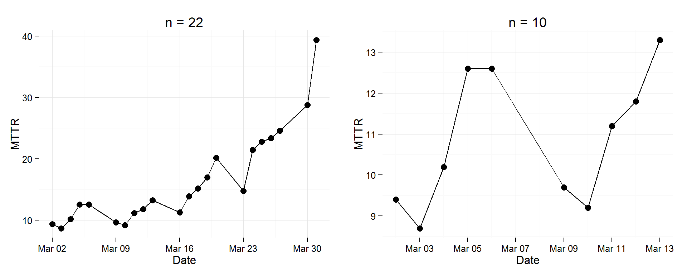

# Stat 266 - Runs of Ups and Downs, and Trend
Adrian Cuyugan  

This is an R Markdown document. Markdown is a simple formatting syntax for authoring HTML, PDF, and MS Word documents. For more details on using R Markdown see <http://rmarkdown.rstudio.com>.

When you click the **Knit** button a document will be generated that includes both content as well as the output of any embedded R code chunks within the document. You can embed an R code chunk like this:


```r
# Code block to install packages
is.installed <- function(x) {
    is.element(x, installed.packages()[,1])
} 

ifelse(!is.installed('randtests'), install.packages('randtests'), require(randtests))
```

```
## [1] TRUE
```

```r
ifelse(!is.installed('ggplot2'), install.packages('ggplot2'), require(ggplot2))
```

```
## [1] TRUE
```

```r
ifelse(!is.installed('gridExtra'), install.packages('gridExtra'), require(gridExtra))
```

```
## [1] TRUE
```

```r
url <- 'https://raw.githubusercontent.com/foxyreign/MasterOfStatistics/master/Stat%20266/Stat%20266%20-%20Assignment%201%20(Runs%20and%20Ups%20and%20Downs).csv'
download.file(url, "MTTR.csv")
assign1 <- read.csv('MTTR.csv', head = T, sep = ',')
assign1$Date <- as.Date(assign1$Date, format = '%Y-%m-%d')
assign1$Subset <- ifelse(assign1$Date < '2015-03-13', 'Exact Test', 'Normal Approx')
mttr.range <- range(assign1$MTTR)

# Normal approximation
bartels.rank.test(assign1$MTTR, alternative = 'left.sided', pvalue = 'normal')
```

```
## 
## 	Bartels Ratio Test
## 
## data:  assign1$MTTR
## statistic = -4.3597, n = 22, p-value = 6.513e-06
## alternative hypothesis: trend
```

```r
# Use exact calculation or beta distribution
bartels.rank.test(assign1[1:10,3], alternative = 'left.sided', pvalue = 'auto')
```

```
## 
## 	Bartels Ratio Test
## 
## data:  assign1[1:10, 3]
## statistic = -1.7088, n = 10, p-value = 0.04334
## alternative hypothesis: trend
```

```r
# Plots the run charts, use fixed y
plot1 <- ggplot(assign1, aes(x = Date, y = MTTR)) + 
  geom_line() + geom_point(size = 3) + 
  theme_minimal() + ylim(mttr.range) +
  ggtitle('Run Chart, n = 22')
plot2 <- ggplot(assign1[1:10,], aes(x = Date, y = MTTR)) +
  geom_line() + geom_point(size = 3) + 
  theme_minimal() + ylim(mttr.range) +
  ggtitle('Run Chart, n = 10')
grid.arrange(plot2, plot1, ncol = 2)
```


